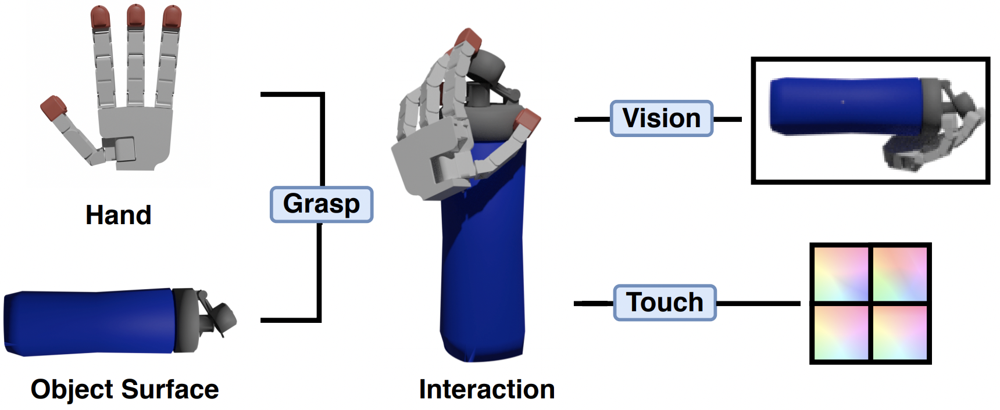

<!---
Copyright (c) Facebook, Inc. and its affiliates.
All rights reserved.
This source code is licensed under the license found in the
LICENSE file in the root directory of this source tree.
-->

Companion code for [E.J. Smith, et al.: 3D Shape Reconstruction from Vision and Touch](https://arxiv.org/abs/2007.03778).

This repository contains a code base and dataset for learning to fuse vision and touch signals from the 
grasp interaction of a simulated robotic hand and 3D obejct for 3D shape reconstruction. The code comes with pre-defined train/valid/test splits
over the dataset released, pretrained models, and training and evaluation scripts. This code base uses a subset of the [ABC Dataset](https://deep-geometry.github.io/abc-dataset/) (released under MIT License) instead of the dataset listed in the paper due to licensing issues. 
We appologise for the discrepancy, however, no data could have been released otherwise. We have provided updated reconstruction accuracies for the new dataset below. 

<p align="center">
  
</p>

If you find this code useful in your research, please consider citing with the following BibTeX entry:

```
@misc{VisionTouch,
Author = {Edward J. Smith and Roberto Calandra and Adriana Romero and Georgia Gkioxari and David Meger and Jitendra Malik and Michal Drozdzal},
Title = {3D Shape Reconstruction from Vision and Touch},
Year = {2020},
journal = {arXiv:1911.05063},
}
```

### Installation

This code uses Python 3.6.9 , PyTorch 1.4.0. and cuda version 10.1

- Installing pytorch:
```bash
$ pip install torch==1.4.0
```

- Install dependencies
```bash
$ pip install -r requirements.txt
```

### Dataset
To download the code call the following, keep in mind this will take some time to download and unpack:
```bash
$ bash download_data.sh
```
This is released under a MIT License. 

### Training

#### Touch Chart Prediction 

To train a model to predict touch charts, ie local geometry at each touch site, first move into the touch chart directory: 
```bash
$ cd touch_charts
``` 
To begin training call: 
```bash
$ python recon.py --exp_type <exp_type> --exp_id <exp_id> 
``` 
where  ```<exp_type>``` and  ```<exp_id>``` are the experiment type and id you wish to specify. There are a number of other arguments 
for changing the default parameters of this training, call with  ```--help``` to view them. 

Checkpoints will be saved under a directory ```"experiments/checkpoint/<exp_type>/<exp_id>/"```,  specified by ```--exp_type``` and  ```--exp_id```. 

To check training progress with Tensorboard:
```bash
$ tensorboard --logdir=experiments/tensorboard/<exp_type>/  --port=6006
```

The training above will only predict a point cloud for each haptic signal. To optimize a mesh sheet to match this predicted point cloud 
and produce a predicted touch chart at every touch site call the following: 
```bash
$ mv data/sheets data/pretrained_sheets
$ python produce_sheets.py.py --save_directory experiments/checkpoint/<exp_type>/<exp_id>/encoder_touch
```

where ```<exp_type>``` and ```<exp_id>``` are the same settings as when training. This will first move the premade sheets produced using the pretrained model. 
If you would like to use the premade sheets simply skip this step. By default the script uses the pretrained model provided to perform this optimization.
Regardless of the model used, this will take some time to complete, and if you would like to use slurm to produce these
sheets, the sumbit.py file can be called instead. 


#### Global Prediction

To train a model to deform vision charts around touch charts and produce a full surface prediction, first move into the vision chart directory: 
```bash
$ cd vision_charts
``` 
To begin training call: 
```bash
$ python recon.py --exp_type <exp_type> --exp_id <exp_id> 
``` 
where  ```<exp_type>``` and  ```<exp_id>``` are the experiment type and id you wish to specify. There are a number of other arguments for changing the default parameters of this training, call with  ```--help``` to view them. 

Checkpoints will be saved under a directory ```"experiments/checkpoint/<exp_type>/<exp_id>/"```,  specified by ```--exp_type``` and  ```--exp_id```. 

To check training progress with Tensorboard:
```bash
$ tensorboard --logdir=experiments/tensorboard/<exp_type>/  --port=6006
```

The same level of hyperparamter search used in the paper can be reproduced using slurm and the submit.py file located in the same folder. 
### Evaluation

#### Touch Chart Prediction 

Perform evaluation of the touch chart prediction, from the touch chart directory as follows:
```bash
$ python recon.py --eval --exp_type <exp_type> --exp_id <exp_id> 
``` 
where  ```<exp_type>``` and  ```<exp_id>``` are the experiment type and id specified during training. 

#### Global Prediction

Perform evaluation of the global prediction, from the vision chart directory as follows:
```bash
$ python recon.py --eval --exp_type <exp_type> --exp_id <exp_id> 
``` 
where  ```<exp_type>``` and  ```<exp_id>``` are the experiment type and id specified during training. 


### Pretrained Models
If you wish to download pretrained models please call the following: 
```bash
$ bash prepare_models.sh
```

To produce touch charts using the pretrained model call: 
```bash
$ cd touch_charts
$ python produce_sheets.py 
```
As this is a time intensive procedure, if you would like to use slurm to produce these
sheets, the sumbit.py file can be called. Premade sheets have also been provided in the dataset however.

To test using the pretrained models to reconstruct objects using different input modalities call: 
```bash
$ cd vision 
$ python recon.py --pretrained <model> --eval
```
where ```<model>``` is one of either ['empty', 'touch', 'touch_unoccluded', 'touch_occluded', 'unoccluded', 'occluded'].

The following table highlights the reconstruction accuracies of these models on the test set:

|                     | No Input     | Touch     | Occluded | Unoccluded | Touch + Occluded | Touch + Unoccluded |
|:-----------------------:|:------------:|:---------:|:--------:|:----------:|:----------------:|:------------------:|
|    Chamfer Distance     | 26.888       | 6.926     | 2.936    | 2.844      | 2.406            | 2.468              |


### License
See [LICENSE](LICENSE.md) for details.
